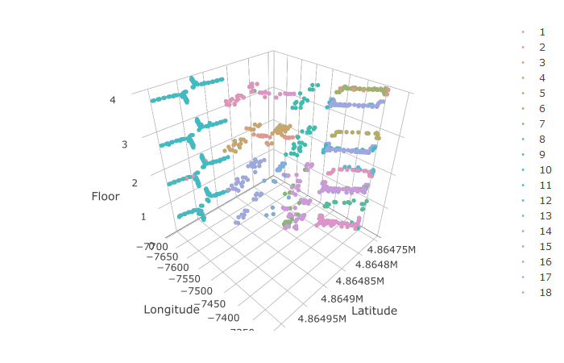

```{r setup, include=FALSE}
knitr::opts_chunk$set(echo = TRUE)
```


The main goal of this task is to evaluate the application of machine learning techniques to the problem of indoor localization via Wi-Fi fingerprinting.  
  
  
####**CODE:**  

```{r message = FALSE, warning = FALSE}
#Loading libraries
library("readr")
library("dplyr")
library("tidyr")
library("lubridate")
library("ggplot2")
library("caret")
library("ggthemes")
library("reshape2")
library("plotly")
library("lattice")
library("colorspace")
  
#loading the datasets
trainingData <- as.data.frame(read_csv("trainingData.csv"))
validationData <- as.data.frame(read_csv("validationData.csv"))
```  

#####**Initial preprocessing**
```{r message = FALSE, warning = FALSE}
#lower case column names
names(trainingData) <- tolower(names(trainingData))
names(validationData) <- tolower(names(validationData))

#joining both datasets for preprocessing
#creating partition column
trainingData$partition <- "train"
validationData$partition <- "validation"

#combining dataframes
dataCombined <- rbind(trainingData, validationData)

#converting time
dataCombined$timestamp <-
  as.POSIXct(dataCombined$timestamp, origin = "1970-01-01", tz = "CET")

#factorizing columns
dataCombined$floor <- as.factor(dataCombined$floor)
dataCombined$buildingid <- as.factor(dataCombined$buildingid)
```  

#####**Preprocessing**
```{r message = FALSE, warning = FALSE}
dataClean <- dataCombined

#replacing WAP signal < -90 dBm (unusable) to -100 (no signal)
dataClean[, 1:(ncol(dataClean) - 10)] <-
  apply(dataClean[, 1:(ncol(dataClean) - 10)], 2, function(x)
    ifelse(x < -90,-100, x))

#replacing WAP signal = 100 to -100 (both = no signal at all)
dataClean[, 1:(ncol(dataClean) - 10)] <-
  apply(dataClean[, 1:(ncol(dataClean) - 10)], 2, function(x)
    ifelse(x == 100,-100, x))

#splitting df
trClean <- dataClean %>% filter(partition == "train")
valClean <- dataClean %>% filter(partition == "validation")

#removing columns with 0 variance
trClean <- trClean[-which(apply(trClean[, 1:(ncol(trClean) - 10)], 2, var) == 0)]

#keeping only unique rows
trClean <- unique(trClean)

#creating df to normalize without the rows with standard deviation = 0, so it doesn't get NaNs
trClean <-
  trClean[which(apply(trClean[, 1:(ncol(trClean) - 10)], 1, sd) != 0),]

valClean <-
  valClean[which(apply(valClean[, 1:(ncol(valClean) - 10)], 1, sd) != 0),]

#keeping same columns in training and validation df
valClean <- valClean[, which(names(valClean) %in% names(trClean))]
```  

#####**Normalizing the data**
```{r message = FALSE, warning = FALSE}
#normalizing by rows
#training
trNormRow <- trClean
trNormRow[, 1:(ncol(trNormRow) - 10)]  <-
  t(apply(trClean[, 1:(ncol(trClean) - 10)], 1, function(x)
    (x - min(x)) / (max(x) - min(x))))

#validation
valNormRow <- valClean
valNormRow[, 1:(ncol(valNormRow) - 10)]  <-
  t(apply(valClean[, 1:(ncol(valClean) - 10)], 1, function(x)
    (x - min(x)) / (max(x) - min(x))))
```
***
#####**Data Visualization**
```{r message = FALSE, warning = FALSE, eval = FALSE}
#colorspace palette
palette <- choose_palette()
colors <- rainbow_hcl(18)

#creating copy of the df to use with plotly
dataPlot <- trClean
dataPlot$floor <- as.numeric(dataPlot$floor)
dataPlot$buildingid <- as.numeric(dataPlot$buildingid)

#range of z axis (floor)
axz <- list(nticks = 6, range = c(0, 4), title = 'Floor')
```

```{r message = FALSE, warning = FALSE, eval = FALSE}
#location of users
plotlyPhoneLocation <-
  plot_ly(
    dataPlot,
    x = dataPlot$latitude,
    y = dataPlot$longitude,
    z = dataPlot$floor,
    color = ~as.factor(dataPlot$userid),
    colors = colors,
    marker = list(size = 3)
  ) %>% add_markers() %>% layout(scene = list(
    xaxis = list(title = 'Latitude'),
    yaxis = list(title = 'Longitude'),
    zaxis = axz
  ))

plotlyPhoneLocation
```



```{r message = FALSE, warning = FALSE, eval = FALSE}
#wifi signals strength
#creating column showing which is the max wap signal
dataPlot <- dataPlot %>% mutate(rowmax = apply(dataPlot[, 1:404],1,max))

#creating column with wifi signal strength
dataPlot <- dataPlot %>%
  mutate(sig_strength = case_when(rowmax < -75 ~ "low", rowmax >= -75 &
                                    rowmax <= -50 ~ "med", rowmax > -50 ~ "high"))

plotlySignal <-
  plot_ly(
    dataPlot,
    x = dataPlot$latitude,
    y = dataPlot$longitude,
    z = dataPlot$floor,
    color = dataPlot$sig_strength,
    colors = c("green", "red", "yellow"),
    marker = list(size = 3)
  ) %>% add_markers() %>% layout(scene = list(
    xaxis = list(title = 'Latitude'),
    yaxis = list(title = 'Longitude'),
    zaxis = axz
  ))

plotlySignal
```


***
#####**Training and Validation**
######**Predicting Building**
```{r message = FALSE, warning = FALSE}
set.seed(123)

#sampling the data (3000 rows) - normalized waps
sampleTrBuild <- trNormRow[sample(nrow(trNormRow), 3000),]

#creating data partition to predict BUILDING ID
inTrainBuild <- createDataPartition(
  sampleTrBuild$buildingid,
  p = .75,
  list = FALSE
)

#creating training and testing df
trainBuild <- sampleTrBuild[inTrainBuild,]
testBuild <-  sampleTrBuild[-inTrainBuild,]

#cross validation
ctrl <- trainControl(
  method = "repeatedcv",
  number = 3,
  repeats = 3
)
```

```{r}
#models
#SVM 3 (best result)
SVM3_Building <- train(
  buildingid ~ .,
  data = trainBuild[, c(1:404,408)],
  method = "svmLinear3",
  scale = FALSE,
  trControl = ctrl
)

SVM3_Building
```

```{r}
#testing
Test_PredSVM3_Build <- predict(
  SVM3_Building,
  newdata = testBuild)

postResample(Test_PredSVM3_Build, testBuild$buildingid)
```

```{r}
#validation
Val_PredSVM3_Build <- predict(
  SVM3_Building,
  newdata = valNormRow)

postResample(Val_PredSVM3_Build, valNormRow$buildingid)
```
  
######**Predicting Floor**
```{r message = FALSE, warning = FALSE}
#creating a new column with the predicted building
valNormRow$predbuildingid <- factor(Val_PredSVM3_Build)

#subsetting buildings (training)
building0 <- trNormRow[which(trNormRow$buildingid == '0'), ]
building1 <- trNormRow[which(trNormRow$buildingid == '1'), ]
building2 <- trNormRow[which(trNormRow$buildingid == '2'), ]

#replacing the actual buildings with the predicted ones
valNormRow$buildingid <- valNormRow$predbuildingid

#subsetting buildings (validation)
vbuilding0 <- valNormRow[which(valNormRow$buildingid == '0'), ]
vbuilding1 <- valNormRow[which(valNormRow$buildingid == '1'), ]
vbuilding2 <- valNormRow[which(valNormRow$buildingid == '2'), ]

#refactoring 'floor' to drop unused levels
building0$floor <- factor(building0$floor)
building1$floor <- factor(building1$floor)
building2$floor <- factor(building2$floor)

vbuilding0$floor <- factor(vbuilding0$floor)
vbuilding1$floor <- factor(vbuilding1$floor)
vbuilding2$floor <- factor(vbuilding2$floor)

#sampling the data (3000 rows each) - normalized rows
sampleTr0 <- building0[sample(nrow(building0), 3000),]
sampleTr1 <- building1[sample(nrow(building1), 3000),]
sampleTr2 <- building2[sample(nrow(building2), 3000),]

# View(head(sampleTr))

#predicting
#creating a separate data partition for each building
inTrain0 <- createDataPartition(
  sampleTr0$floor,
  p = .75,
  list = FALSE
)

inTrain1 <- createDataPartition(
  sampleTr1$floor,
  p = .75,
  list = FALSE
)

inTrain2 <- createDataPartition(
  sampleTr2$floor,
  p = .75,
  list = FALSE
)

#creating training and testing df
trainNormRow0 <- sampleTr0[inTrain1,]
testNormRow0 <-  sampleTr0[-inTrain1,]

trainNormRow1 <- sampleTr1[inTrain1,]
testNormRow1 <-  sampleTr1[-inTrain1,]

trainNormRow2 <- sampleTr2[inTrain2,]
testNormRow2 <-  sampleTr2[-inTrain2,]

#overwriting with predictions for building
testNormRow_all <- rbind(testNormRow0,testNormRow1,testNormRow2)
testNormRow_all$buildingid <- predict(SVM3_Building,newdata = testNormRow_all)

#subsetting
testNormRow0 <- testNormRow_all[which(testNormRow_all$buildingid == '0'), ]
testNormRow1 <- testNormRow_all[which(testNormRow_all$buildingid == '1'), ]
testNormRow2 <- testNormRow_all[which(testNormRow_all$buildingid == '2'), ]
```

```{r}
#training models
#> SVM Linear
SVM_Floor0 <- train(
  floor ~ .,
  data = trainNormRow0[, c(1:404,407)],
  method = "svmLinear",
  scale = FALSE,
  trControl = ctrl
)

SVM_Floor0
```

```{r}
SVM_Floor1 <- train(
  floor ~ .,
  data = trainNormRow1[, c(1:404,407)],
  method = "svmLinear",
  scale = FALSE,
  trControl = ctrl
)

SVM_Floor1
```

```{r}
SVM_Floor2 <- train(
  floor ~ .,
  data = trainNormRow2[, c(1:404,407)],
  method = "svmLinear",
  scale = FALSE,
  trControl = ctrl
)

SVM_Floor2
```

```{r}
#testing
#floors from building 0
Test_PredSVM_Floor0 <- predict(
  SVM_Floor0,
  newdata = testNormRow0)

postResample(Test_PredSVM_Floor0, testNormRow0$floor)

```

```{r}
#building 1
Test_PredSVM_Floor1 <- predict(
  SVM_Floor1,
  newdata = testNormRow1)

postResample(Test_PredSVM_Floor1, testNormRow1$floor)
```

```{r}
#building 2
Test_PredSVM_Floor2 <- predict(
  SVM_Floor2,
  newdata = testNormRow2)

postResample(Test_PredSVM_Floor2, testNormRow2$floor)
```

```{r}
#validation
#building 0
Val_PredSVM_Floor0 <- predict(
  SVM_Floor0,
  newdata = vbuilding0)

postResample(Val_PredSVM_Floor0, vbuilding0$floor)
```

```{r}
#building 1
Val_PredSVM_Floor1 <- predict(
  SVM_Floor1,
  newdata = vbuilding1)

postResample(Val_PredSVM_Floor1, vbuilding1$floor)
```

```{r}
#building 2
Val_PredSVM_Floor2 <- predict(
  SVM_Floor2,
  newdata = vbuilding2)

postResample(Val_PredSVM_Floor2, vbuilding2$floor)
```

######**Predicting Longitude & Latitude**
```{r message = FALSE, warning = FALSE}
inTrainLAT <- createDataPartition(
  sampleTrBuild$latitude, #recycling sample from training building
  p = .75,
  list = FALSE
)

inTrainLONG <- createDataPartition(
  sampleTrBuild$longitude,
  p = .75,
  list = FALSE
)

#creating training and testing df
trainLat <- sampleTrBuild[inTrainLAT,]
testLat <-  sampleTrBuild[-inTrainLAT,]

trainLong <- sampleTrBuild[inTrainLONG,]
testLong <-  sampleTrBuild[-inTrainLONG,]
```

```{r}
#training models
#longitude
KNN_Long <- train(
  longitude ~ .,
  data = trainLong[, c(1:404,405)],
  method = "knn",
  scale = FALSE,
  trControl = ctrl
)

KNN_Long
```

```{r}
#latitude
KNN_Lat <- train(
  latitude ~ .,
  data = trainLat[, c(1:404,406)],
  method = "knn",
  scale = FALSE,
  trControl = ctrl
)

KNN_Lat
```

```{r}
#testing
#longitude
Test_PredKNN_Long <- predict(
  KNN_Long,
  newdata = testLong)

postResample(Test_PredKNN_Long, testLong$longitude)
```

```{r}
#latitude
Test_PredKNN_Lat <- predict(
  KNN_Lat,
  newdata = testLat)

postResample(Test_PredKNN_Lat, testLat$latitude)
```

```{r}
#validation
#longitude
Val_PredKNN_Long <- predict(
  KNN_Long,
  newdata = valNormRow)

postResample(Val_PredKNN_Long, valNormRow$longitude)
```

```{r}
#latitude
Val_PredKNN_Lat <- predict(
  KNN_Lat,
  newdata = valNormRow)

postResample(Val_PredKNN_Lat, valNormRow$latitude)
```

```{r}
#checking the error distance
valNormRow$error_distance <- sqrt((valNormRow$latitude - Val_PredKNN_Lat)^2 +
                                    (valNormRow$longitude - Val_PredKNN_Long)^2)
summary(valNormRow$error_distance)
```

```{r}
boxplot(valNormRow$error_distance)
```